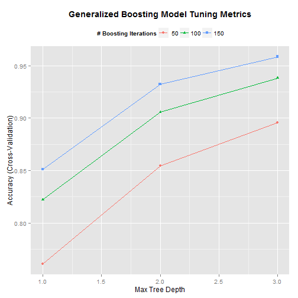

# Classifying Exercises in the Human Activity Recognition WLE Dataset

## Synopsis
In this analysis, we explore the Human Activity Recognition WLE dataset (available [here](http://groupware.les.inf.puc-rio.br/har)) to develop a model to predict the type of barbell lift participants wearing accelerometers were executing:

* Class A: Exactly according to the specification
* Class B: Throwing the elbows to the front
* Class C: Lifting the dumbbell only halfway
* Class D: Lowering the dumbbell only halfway
* Class E: Throwing the hips to the front

Data from the accelerometers was compiled to generate the WLE dataset containing 159 predictors linked above. This dataset was preprocessed and used to train a Generalized Boosting Model using 3-fold cross-validation to reduce overfitting.  The resulting model was then used to predict 20 test cases.

## Data Processing

The caret and gbm libraries were used to train the model, and the xtable and ggplot2 libraries were used to present results.

```r
library(caret); library(gbm); library(xtable); library(ggplot2)
```


The HAR WLE data was downloaded and read into R using the read.csv function.  The data was then partitioned into training and test sets (with 1/4 of the data being set aside for testing/tuning).

The resulting training data was processed by removing columns in which more than half of the data was NA (this actually ended up removing all of the NAs from the dataset) and removing columns in which there was near-zero variance.

```r
## Download training dataset
trainURL <- "https://d396qusza40orc.cloudfront.net/predmachlearn/pml-training.csv"
temp <- tempfile(); download.file(trainURL, temp)
trainData <- read.csv(temp); unlink(temp)

## Partition training dataset, reserving 1/4 of the data for testing/tuning.
inTrain <- createDataPartition(trainData$classe, p = 3/4)[[1]]
training <- trainData[inTrain,]; testing <- trainData[-inTrain,]

## Remove columns with a lot of NAs and/or very little variance. 
naFree <- sapply(training, function(x) sum(is.na(x))<(nrow(training)/2))
training <- training[,naFree]
nzvCols <- nearZeroVar(training, saveMetrics=F)
training <- training[,-nzvCols]
```


## Building the model

The new, leaner, meaner dataset comprising 14,718 observations of 59 variables (52, excluding the predictee and six ID/timestamp variables) was used to train a model using the gbm package (which combines boosting with decision trees).  3-fold cross-validation was used to reduce the impact of overfitting.

```r
fitnessModel <-train(training$classe~.,method="gbm",
                     trControl=trainControl(method = "cv", number=3),
                     data=training[,-c(1:6,59)], verbose=F)
```


The most influential variables according to this model are reproduced below. The roll_belt variable is by far the most influential in this model.

```r
influencers <- summary(fitnessModel, plotit=F)[1:10,]; rownames(influencers) <- NULL
print(xtable(influencers), type="html")
```

<!-- html table generated in R 3.0.2 by xtable 1.7-3 package -->
<!-- Fri Oct 24 15:57:18 2014 -->
<TABLE border=1>
<TR> <TH>  </TH> <TH> var </TH> <TH> rel.inf </TH>  </TR>
  <TR> <TD align="right"> 1 </TD> <TD> roll_belt </TD> <TD align="right"> 22.36 </TD> </TR>
  <TR> <TD align="right"> 2 </TD> <TD> pitch_forearm </TD> <TD align="right"> 11.17 </TD> </TR>
  <TR> <TD align="right"> 3 </TD> <TD> yaw_belt </TD> <TD align="right"> 8.51 </TD> </TR>
  <TR> <TD align="right"> 4 </TD> <TD> magnet_dumbbell_z </TD> <TD align="right"> 6.33 </TD> </TR>
  <TR> <TD align="right"> 5 </TD> <TD> roll_forearm </TD> <TD align="right"> 5.56 </TD> </TR>
  <TR> <TD align="right"> 6 </TD> <TD> magnet_dumbbell_y </TD> <TD align="right"> 5.05 </TD> </TR>
  <TR> <TD align="right"> 7 </TD> <TD> magnet_belt_z </TD> <TD align="right"> 4.40 </TD> </TR>
  <TR> <TD align="right"> 8 </TD> <TD> gyros_belt_z </TD> <TD align="right"> 3.47 </TD> </TR>
  <TR> <TD align="right"> 9 </TD> <TD> accel_forearm_x </TD> <TD align="right"> 2.97 </TD> </TR>
  <TR> <TD align="right"> 10 </TD> <TD> accel_dumbbell_y </TD> <TD align="right"> 2.89 </TD> </TR>
   </TABLE>


As can be seen from the chart below, increased power in the form of both more boosting iterations and a greater maximum tree depth seem likely to improve accuracy further. These options were not explored further due to limited computing  resources (the model already takes kind of a while to train).

```r
ggplot(fitnessModel) + 
        theme(legend.position="top", plot.title=element_text(face="bold")) +
        ggtitle("Generalized Boosting Model Tuning Metrics")
```

 


## Results


```r
conMatrix <- confusionMatrix(testing$classe, predict(fitnessModel, testing))
print(conMatrix$overall)
```

```
##       Accuracy          Kappa  AccuracyLower  AccuracyUpper   AccuracyNull 
##   9.616639e-01   9.514996e-01   9.559062e-01   9.668633e-01   2.869086e-01 
## AccuracyPValue  McnemarPValue 
##   0.000000e+00   4.383451e-08
```

Using the model on the partitioned test data set shows a predicted model accuracy of 96.17% (that is to say, an out-of-sample error rate of 3.83%).


We are now prepared to download the 20 test cases and generate the model's final predictions below:

```r
## Download testing dataset
testURL <- "https://d396qusza40orc.cloudfront.net/predmachlearn/pml-testing.csv"
temp <- tempfile()
download.file(testURL, temp)
testData <- read.csv(temp)
unlink(temp)

## Generate model predictions
fmPredict <- data.frame(predict(fitnessModel, testData))
colnames(fmPredict) <- "Model.Prediction"
print(xtable(fmPredict), type="html")
```

<!-- html table generated in R 3.0.2 by xtable 1.7-3 package -->
<!-- Fri Oct 24 15:55:15 2014 -->
<TABLE border=1>
<TR> <TH>  </TH> <TH> Model.Prediction </TH>  </TR>
  <TR> <TD align="right"> 1 </TD> <TD> B </TD> </TR>
  <TR> <TD align="right"> 2 </TD> <TD> A </TD> </TR>
  <TR> <TD align="right"> 3 </TD> <TD> B </TD> </TR>
  <TR> <TD align="right"> 4 </TD> <TD> A </TD> </TR>
  <TR> <TD align="right"> 5 </TD> <TD> A </TD> </TR>
  <TR> <TD align="right"> 6 </TD> <TD> E </TD> </TR>
  <TR> <TD align="right"> 7 </TD> <TD> D </TD> </TR>
  <TR> <TD align="right"> 8 </TD> <TD> B </TD> </TR>
  <TR> <TD align="right"> 9 </TD> <TD> A </TD> </TR>
  <TR> <TD align="right"> 10 </TD> <TD> A </TD> </TR>
  <TR> <TD align="right"> 11 </TD> <TD> B </TD> </TR>
  <TR> <TD align="right"> 12 </TD> <TD> C </TD> </TR>
  <TR> <TD align="right"> 13 </TD> <TD> B </TD> </TR>
  <TR> <TD align="right"> 14 </TD> <TD> A </TD> </TR>
  <TR> <TD align="right"> 15 </TD> <TD> E </TD> </TR>
  <TR> <TD align="right"> 16 </TD> <TD> E </TD> </TR>
  <TR> <TD align="right"> 17 </TD> <TD> A </TD> </TR>
  <TR> <TD align="right"> 18 </TD> <TD> B </TD> </TR>
  <TR> <TD align="right"> 19 </TD> <TD> B </TD> </TR>
  <TR> <TD align="right"> 20 </TD> <TD> B </TD> </TR>
   </TABLE>
